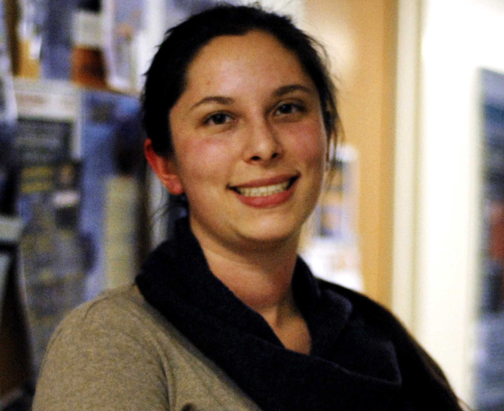

## About Me

I'm a postdoc at the University of Hawaii at Manoa studying Solar energetic particles with the AMS experiment. I got my Ph.D. at UCLA working with Rene Ong to study astrophysical objects in the Cygnus region of the Galaxy with VERITAS.

## Research Interests

cosmic rays, particle astrophysics, astrophysics experiment, high energy physics experiment, heliophysics, gamma-ray astrophysics, neutrino physics

## Outreach Activities

HI STAR at UH Manoa -- mentored middle and high school students in cosmic ray physics experiments; developed a tutorial for neutron monitor data analysis

Expanding Your Horizons at UH Manoa -- led workshop for middle school aged girls titled "Mission to Mars: Space Radiation"

Women in Physics and Astronomy (WiPA) at UCLA -- founded group; started mentoring program
        
Exploring Your Universe at UCLA -- Merchandise Coordinator, 2015; Developed and led VERITAS booth, 2013, 2014, 2015

## Publications
